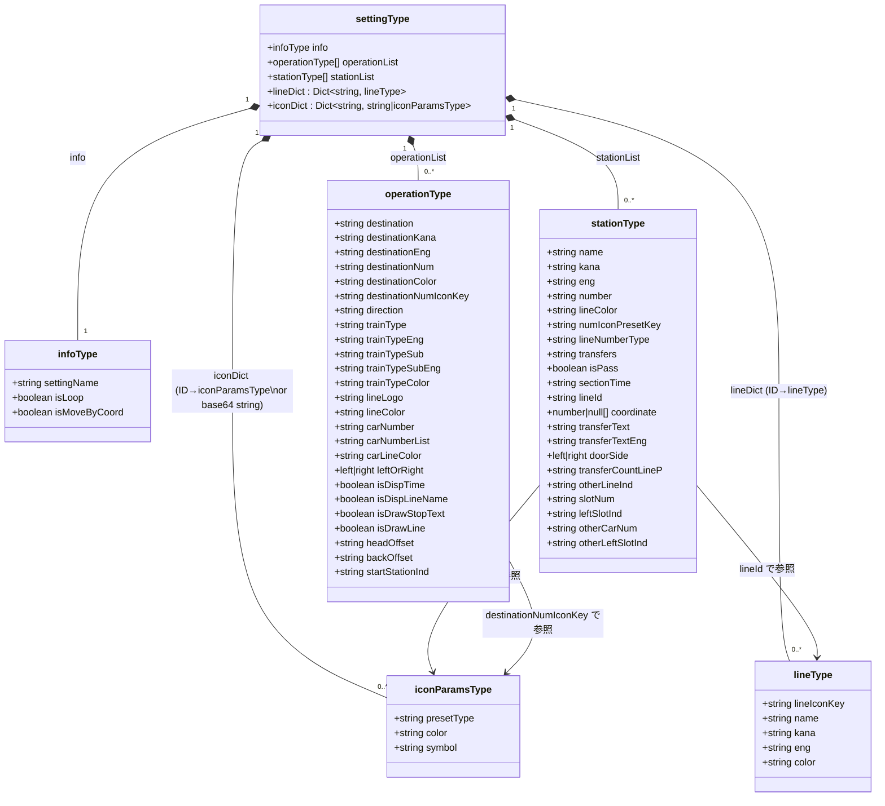
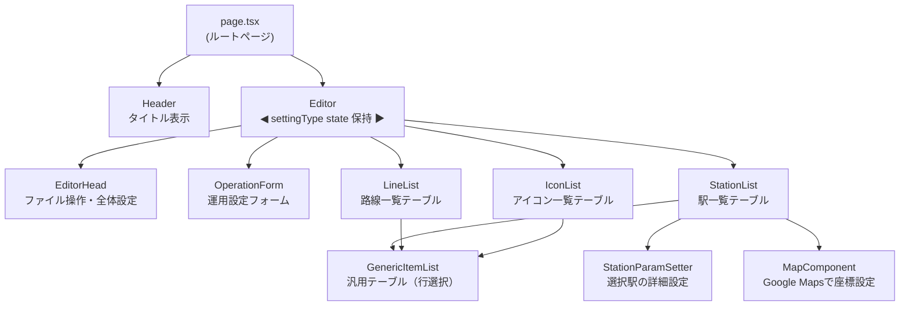
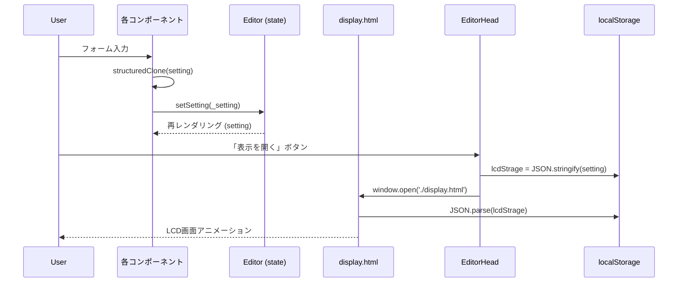
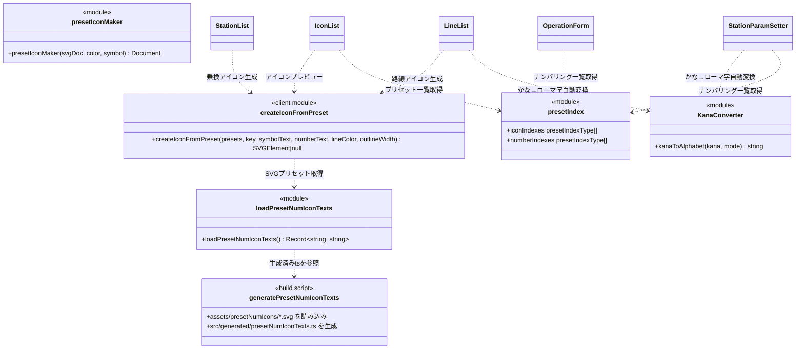

# LCDシミュレーター 仕様書

## 1. 概要

日本の鉄道車両に搭載されているLCD行先表示器をブラウザ上でシミュレートするWebアプリケーション。設定エディタで路線・駅・運用情報を編集し、実際の表示画面をリアルタイムに確認できる。

| 項目 | 内容 |
|------|------|
| フレームワーク | Next.js 15.3 (App Router) |
| 言語 | TypeScript / React 18 |
| 動作環境 | モダンブラウザ（SSR なし、クライアントサイド動作） |

---

## 2. システム全体構成

```
┌─────────────────────────────────────────────────────┐
│  ブラウザ                                             │
│                                                       │
│  ┌─────────────────────────────┐  localStorage       │
│  │  設定エディタ (Next.js App) │ ──────────────────┐ │
│  │  http://localhost:3000      │                   │ │
│  └─────────────────────────────┘                   ▼ │
│                                          ┌──────────────────┐ │
│                                          │ display.html     │ │
│                                          │ (東急スタイル)   │ │
│                                          ├──────────────────┤ │
│                                          │Display_JW-225.html│ │
│                                          │(JR西225系スタイル)│ │
│                                          └──────────────────┘ │
└─────────────────────────────────────────────────────┘
```

エディタで編集した設定データは `localStorage['lcdStrage']` に保存され、表示用HTMLページが読み込んでLCDアニメーションを描画する。

---

## 3. データモデル

### 3.1 UML クラス図



### 3.2 フィールド詳細

#### `infoType` — 全体設定
| フィールド | 型 | 説明 |
|---|---|---|
| `settingName` | string | 設定ファイル名 |
| `isLoop` | boolean | 環状運転モード（終点→始点へ自動折返し） |
| `isMoveByCoord` | boolean | GPS座標に基づいて現在駅を自動移動 |

#### `operationType` — 運用設定（表示内容1セット）
| フィールド | 型 | 説明 |
|---|---|---|
| `destination` / `destinationKana` / `destinationEng` | string | 行先（日本語・かな・英語） |
| `destinationNum` | string | 行先ナンバリング記号（例: `JT-01`） |
| `destinationColor` | string | 行先表示の文字色（HEX） |
| `destinationNumIconKey` | string | 行先ナンバリングのアイコンキー |
| `direction` | string | 経由・方面表示 |
| `trainType` / `trainTypeEng` | string | 列車種別（例: 急行 / Express） |
| `trainTypeSub` / `trainTypeSubEng` | string | 種別補足テキスト |
| `trainTypeColor` | string | 種別文字色 |
| `lineLogo` | string | 列車路線記号 |
| `lineColor` | string | 列車路線色 |
| `carNumber` | string | 現在の号車番号 |
| `carNumberList` | string | 全号車リスト（カンマ区切り。`*`付きが現在号車） |
| `leftOrRight` | `'left'\|'right'` | 表示の進行方向 |
| `isDispTime` | boolean | 所要時間表示 ON/OFF |
| `isDispLineName` | boolean | 路線名表示 ON/OFF |
| `isDrawStopText` | boolean | 次停車駅テキスト表示 ON/OFF |
| `isDrawLine` | boolean | 号車ライン描画 ON/OFF |
| `headOffset` / `backOffset` | string | 列車前後のオフセット（px） |
| `carLineColor` | string | 号車ラインの色 |
| `startStationInd` | string | 運用開始駅のインデックス |

#### `stationType` — 駅設定
| フィールド | 型 | 説明 |
|---|---|---|
| `name` / `kana` / `eng` | string | 駅名（日本語・かな・英語） |
| `number` | string | 駅ナンバリング（例: `TY 01`） |
| `lineColor` | string | この駅の路線カラー（HEX） |
| `numIconPresetKey` | string | ナンバリングアイコンのプリセットキー |
| `lineNumberType` | string | ナンバリング表示形式（`"0"`: テキスト, `"1"`: アイコン） |
| `transfers` | string | 乗換路線IDリスト（スペース区切り） |
| `isPass` | boolean | 通過駅フラグ |
| `sectionTime` | string | 次駅までの所要時間（分） |
| `lineId` | string | この駅以降の区間路線ID |
| `coordinate` | `[number\|null, number\|null]` | 緯度・経度（GPS連動用） |
| `transferText` / `transferTextEng` | string | 乗換案内テキスト（`:アイコンキー:` 記法対応） |
| `doorSide` | `'left'\|'right'` | 開くドアの方向 |
| `transferCountLineP` | string | ホーム乗換案内の行ごと表示数 |
| `slotNum` | string | ホームスロット分割数 |
| `leftSlotInd` | string | 列車左端スロット番号 |
| `otherLineInd` | string | 向かいホーム列車の路線ID |
| `otherCarNum` | string | 向かいホーム列車の両数 |
| `otherLeftSlotInd` | string | 向かいホーム列車の左端スロット |

#### `lineType` — 路線定義
| フィールド | 型 | 説明 |
|---|---|---|
| `lineIconKey` | string | 路線アイコンの `iconDict` キー |
| `name` / `kana` / `eng` | string | 路線名（日本語・かな・英語） |
| `color` | string | 路線カラー（HEX） |

#### `iconParamsType` — アイコンパラメータ（プリセット型）
| フィールド | 型 | 説明 |
|---|---|---|
| `presetType` | string | プリセット種別キー（例: `I_tokyu`） |
| `color` | string | 路線カラー（HEX） |
| `symbol` | string | 路線記号文字（例: `TY`） |

`iconDict` の値は `string`（base64 data URI）または `iconParamsType` の2種類。

---

## 4. コンポーネント構成

### 4.1 コンポーネント図



### 4.2 `GenericItemList` — 汎用テーブルコンポーネント

`StationList`・`LineList`・`IconList` で共通している「テーブル描画＋行選択のハイライト」ロジックを一箇所に集約した汎用コンポーネント。

#### 型定義

```typescript
// カラム定義
type ColumnDef<T> = {
    header: string                              // <th> ヘッダーテキスト
    cell: (row: T, key: string) => React.ReactNode  // セル内容の描画関数
    isSelector?: boolean  // true のとき <th> として描画しクリックで行選択
}

// Props
type GenericItemListProps<T> = {
    columns: ColumnDef<T>[]
    rows: { key: string; data: T }[]    // 表示データ（key で行を識別）
    selectedKeys: string[]
    onRowClick: (key: string) => void   // 行クリック時のコールバック
    tableId?: string
    containerId?: string
}
```

#### データの正規化

配列・辞書どちらのデータも `rows: { key: string; data: T }[]` 形式に変換して渡す。

| 元データ | 変換例 |
|----------|--------|
| `stationList[]` | `stationList.map((s, i) => ({ key: String(i), data: s }))` |
| `lineDict{}` | `Object.entries(lineDict).map(([k, v]) => ({ key: k, data: v }))` |
| `iconDict{}` | `Object.entries(iconDict).map(([k, v]) => ({ key: k, data: v }))` |

#### 描画規則

- `isSelector: true` のカラムは `<th>` として描画し、クリックで `onRowClick(key)` を呼ぶ
- `selectedKeys` に含まれる行の `isSelector` セルに `className="selected"` を付与
- `isSelector: false` または未指定のカラムは `<td>` として描画

#### 各コンポーネントの責務（変更なし）

`GenericItemList` はテーブルの描画と行選択通知のみを担い、以下は各コンポーネントが引き続き担当する：

- `selectedKeys` の管理（単一選択 / 複数選択は各コンポーネントで実装）
- 追加・削除・編集操作
- `ColumnDef.cell` 関数によるカスタムセル描画（アイコン表示、カラーセルなど）
- 追加フォーム・詳細設定パネルの表示

### 4.3 状態管理

`Editor.tsx` が `settingType` の React state（`useState`）を保有し、`setting` と `setSetting` を全子コンポーネントへ props で渡す。各コンポーネントは変更時に `structuredClone(setting)` でディープコピーを作成してから値を書き換え `setSetting` を呼ぶ。



---

## 5. モジュール構成



| モジュール | 説明 |
|---|---|
| `createIconFromPreset.client.ts` | SVGプリセットにシンボル文字・路線色を合成してSVG要素を返す（ブラウザ専用） |
| `loadPresetNumIconTexts.ts` | `src/generated/presetNumIconTexts.ts` から全SVGプリセットを辞書形式で返す |
| `presetIndex.ts` | アイコン・ナンバリングプリセットの key/name リスト定義 |
| `KanaConverter.tsx` | ひらがな/カタカナ → ローマ字変換（駅名・路線名の英語自動補完） |
| `presetIconMaker.tsx` | SVG DOM にカラー・シンボルを適用するユーティリティ |
| `generatePresetNumIconTexts.js` | ビルド用スクリプト。`assets/presetNumIcons/*.svg` を読み込み TypeScript ファイルを生成 |

---

## 6. アイコンプリセット

### プリセット種別一覧

| キー | 名称 | 用途 |
|---|---|---|
| `I_tokyu` | 東急 | 路線アイコン |
| `I_JR_east` | JR東日本 | 路線アイコン |
| `I_tokyo_subway` | 東京地下鉄 | 路線アイコン |
| `I_JR_west` | JR西日本 | 路線アイコン |
| `I_mono_color` | 単色 | 路線アイコン |
| `I_train_normal1` | 地上路線汎用１ | 路線アイコン |
| `I_train_normal2` | 地上路線汎用２ | 路線アイコン |
| `I_train_subway1` | 地下路線汎用 | 路線アイコン |
| `N_tokyu` | 東急 | ナンバリング |
| `N_JR_east` | JR東日本 | ナンバリング |
| `N_tokyo_subway` | 東京地下鉄 | ナンバリング |
| `N_JR_west` | JR西日本 | ナンバリング |
| `N_JR_central` | JR東海 | ナンバリング |

### SVG プリセットの構造

SVGファイル内の予約済みID要素に対して `createIconFromPreset` が値を注入する。

| ID | 役割 |
|---|---|
| `lineColor` | `fill` 属性を引数 `lineColor` で上書き |
| `symbolArea` | 路線記号テキスト描画領域（将来対応） |
| `numberArea` | ナンバリングテキスト描画領域（将来対応） |
| `outline` | アウトライン要素（`outlineWidth > 0` の時のみ追加） |

---

## 7. 表示出力仕様

### データ受け渡し

```
設定エディタ  ──(JSON.stringify)──▶  localStorage['lcdStrage']  ──▶  display.html
```

### 対応表示タイプ

| 値 | ファイル | 対象車両 |
|---|---|---|
| `tokyu` | `public/display.html` | 東急スタイル |
| `JW-225` | `public/Display_JW-225.html` | JR西日本 225系 |
| `JE-E131` | （未実装） | JR東日本 E131系 |

---

## 8. ファイル入出力

### 設定ファイル（JSON）

`settingType` オブジェクトをそのまま JSON シリアライズしたファイル。拡張子は `.json`。

**インポート時の補完処理：**
ファイル読み込み時に `mergeProperties` 関数で、JSONに存在しないフィールドを初期値で補完する。これにより旧バージョンの設定ファイルも互換動作する。

### ローカルストレージ

| キー | 内容 |
|---|---|
| `lcdStrage` | `settingType` の JSON 文字列 |

---

## 9. 乗換案内テキスト記法

`stationType.transferText` / `transferTextEng` フィールドでは、アイコンの埋め込みに以下の記法を使用する。

```
:アイコンキー:路線名
```

例：
```
:TY:東急東横線
:MG:東急目黒線
```

`iconDict` に登録されたキーを `:key:` 形式で記述すると、表示側で対応するアイコン画像に置換される。
