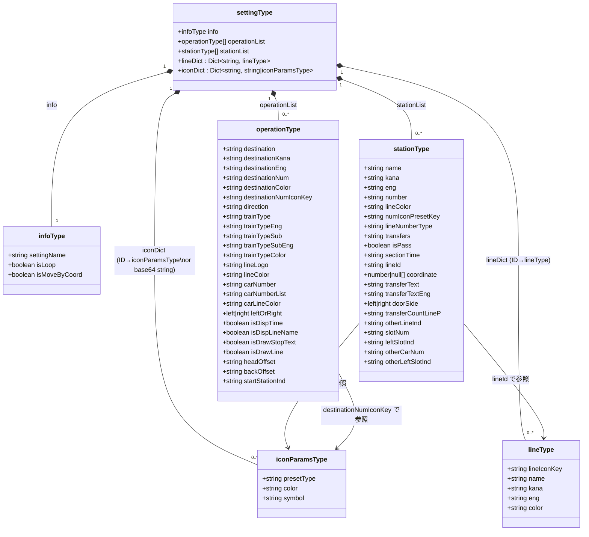
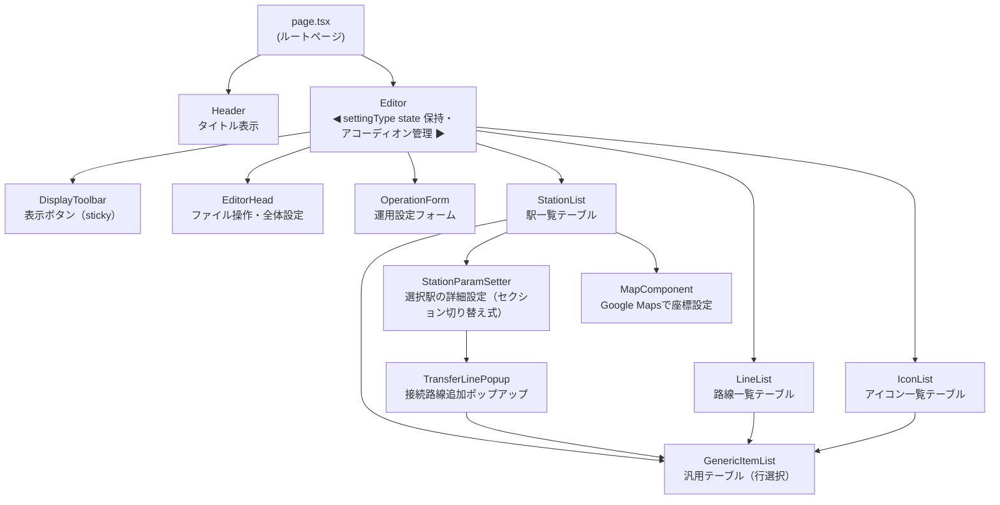
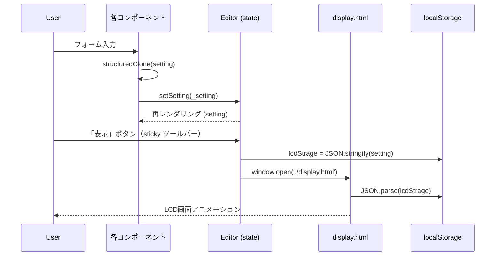
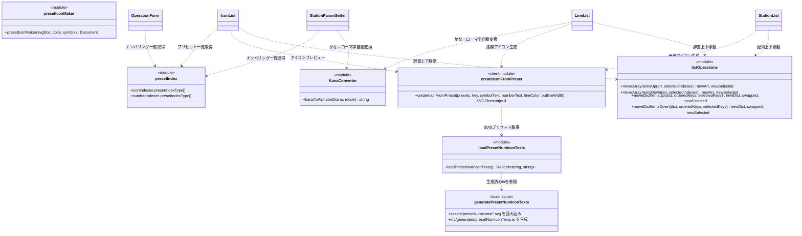

# LCDシミュレーター 仕様書

## 1. 概要

日本の鉄道車両に搭載されているLCD行先表示器をブラウザ上でシミュレートするWebアプリケーション。設定エディタで路線・駅・運用情報を編集し、実際の表示画面をリアルタイムに確認できる。

| 項目 | 内容 |
|------|------|
| フレームワーク | Next.js 15.3 (App Router) |
| 言語 | TypeScript / React 18 |
| 動作環境 | モダンブラウザ（SSR なし、クライアントサイド動作） |

---

## 2. システム全体構成

```
┌─────────────────────────────────────────────────────┐
│  ブラウザ                                             │
│                                                       │
│  ┌─────────────────────────────┐  localStorage       │
│  │  設定エディタ (Next.js App) │ ──────────────────┐ │
│  │  http://localhost:3000      │                   │ │
│  └─────────────────────────────┘                   ▼ │
│                                          ┌──────────────────┐ │
│                                          │ display.html     │ │
│                                          │ (東急スタイル)   │ │
│                                          ├──────────────────┤ │
│                                          │Display_JW-225.html│ │
│                                          │(JR西225系スタイル)│ │
│                                          └──────────────────┘ │
└─────────────────────────────────────────────────────┘
```

エディタで編集した設定データは `localStorage['lcdStrage']` に保存され、表示用HTMLページが読み込んでLCDアニメーションを描画する。

---

## 3. データモデル

### 3.1 UML クラス図



### 3.2 フィールド詳細

#### `infoType` — 全体設定
| フィールド | 型 | 説明 |
|---|---|---|
| `settingName` | string | 設定ファイル名 |
| `isLoop` | boolean | 環状運転モード（終点→始点へ自動折返し） |
| `isMoveByCoord` | boolean | GPS座標に基づいて現在駅を自動移動 |

#### `operationType` — 運用設定（表示内容1セット）
| フィールド | 型 | 説明 |
|---|---|---|
| `destination` / `destinationKana` / `destinationEng` | string | 行先（日本語・かな・英語） |
| `destinationNum` | string | 行先ナンバリング記号（例: `JT-01`） |
| `destinationColor` | string | 行先表示の文字色（HEX） |
| `destinationNumIconKey` | string | 行先ナンバリングのアイコンキー |
| `direction` | string | 経由・方面表示 |
| `trainType` / `trainTypeEng` | string | 列車種別（例: 急行 / Express） |
| `trainTypeSub` / `trainTypeSubEng` | string | 種別補足テキスト |
| `trainTypeColor` | string | 種別文字色 |
| `lineLogo` | string | 列車路線記号 |
| `lineColor` | string | 列車路線色 |
| `carNumber` | string | 現在の号車番号 |
| `carNumberList` | string | 全号車リスト（カンマ区切り。`*`付きが現在号車） |
| `leftOrRight` | `'left'\|'right'` | 表示の進行方向 |
| `isDispTime` | boolean | 所要時間表示 ON/OFF |
| `isDispLineName` | boolean | 路線名表示 ON/OFF |
| `isDrawStopText` | boolean | 次停車駅テキスト表示 ON/OFF |
| `isDrawLine` | boolean | 号車ライン描画 ON/OFF |
| `headOffset` / `backOffset` | string | 列車前後のオフセット（px） |
| `carLineColor` | string | 号車ラインの色 |
| `startStationInd` | string | 運用開始駅のインデックス |

#### `stationType` — 駅設定
| フィールド | 型 | 説明 |
|---|---|---|
| `name` / `kana` / `eng` | string | 駅名（日本語・かな・英語） |
| `number` | string | 駅ナンバリング（例: `TY 01`） |
| `lineColor` | string | この駅の路線カラー（HEX） |
| `numIconPresetKey` | string | ナンバリングアイコンのプリセットキー |
| `lineNumberType` | string | ナンバリング表示形式（`"0"`: テキスト, `"1"`: アイコン） |
| `transfers` | string | 乗換路線IDリスト（スペース区切り） |
| `isPass` | boolean | 通過駅フラグ |
| `sectionTime` | string | 次駅までの所要時間（分） |
| `lineId` | string | この駅以降の区間路線ID |
| `coordinate` | `[number\|null, number\|null]` | 緯度・経度（GPS連動用） |
| `transferText` / `transferTextEng` | string | 乗換案内テキスト（`:アイコンキー:` 記法対応） |
| `doorSide` | `'left'\|'right'` | 開くドアの方向 |
| `transferCountLineP` | string | ホーム乗換案内の行ごと表示数 |
| `slotNum` | string | ホームスロット分割数 |
| `leftSlotInd` | string | 列車左端スロット番号 |
| `otherLineInd` | string | 向かいホーム列車の路線ID |
| `otherCarNum` | string | 向かいホーム列車の両数 |
| `otherLeftSlotInd` | string | 向かいホーム列車の左端スロット |

#### `lineType` — 路線定義
| フィールド | 型 | 説明 |
|---|---|---|
| `lineIconKey` | string | 路線アイコンの `iconDict` キー |
| `name` / `kana` / `eng` | string | 路線名（日本語・かな・英語） |
| `color` | string | 路線カラー（HEX） |

#### `iconParamsType` — アイコンパラメータ（プリセット型）
| フィールド | 型 | 説明 |
|---|---|---|
| `presetType` | string | プリセット種別キー（例: `I_tokyu`） |
| `color` | string | 路線カラー（HEX） |
| `symbol` | string | 路線記号文字（例: `TY`） |

`iconDict` の値は `string`（base64 data URI）または `iconParamsType` の2種類。

---

## 4. コンポーネント構成

### 4.1 コンポーネント図



### 4.2 セクションアコーディオン

`Editor` 内の各セクション（ファイル操作・運用設定・駅設定・路線登録・アイコン登録）は、見出し行クリックで本体を開閉するアコーディオン形式とする。

#### 動作仕様

- 各セクションに `isOpen: boolean` state を持ち、初期値はすべて `true`（展開済み）
- 見出し行（`.section-header`）をクリック/タップすると `isOpen` をトグルする
- `isOpen === false` のとき本体（`.section-body`）を非表示にする（`display: none`）
- 開閉状態を示す矢印アイコン（`▼` / `▶`）を見出し右端に表示する

#### 実装方針

- `Editor.tsx` の各 `editor-section` div を **`AccordionSection`** コンポーネントに置き換える
- `AccordionSection` は `title: string` と `children` を受け取る汎用コンポーネントとして `app/components/AccordionSection.tsx` に定義する
- 各子コンポーネント（`EditorHead` など）の内部 `<h2>` 見出しは不要になるため削除する

#### CSS クラス

| クラス | 役割 |
|--------|------|
| `.section-header` | クリック可能な見出し行（`cursor: pointer`） |
| `.section-header-title` | 見出しテキスト（既存 `h2` スタイルを流用） |
| `.section-header-arrow` | 開閉矢印（右端に配置） |
| `.section-body` | 開閉対象の本体コンテンツ領域 |

### 4.4 表示ツールバー（sticky ツールバー）

`Editor` コンポーネント内に sticky ツールバーを設け、ヘッダー直下に固定表示する。

- `position: sticky; top: [ヘッダー高さ]; z-index: 99` で画面スクロールに追従する
- **「表示」ボタン**（`btn-primary`）のみを配置する
- 表示タイプセレクタは `EditorHead` の元の位置に残す
- `displayType` state は `EditorHead` で引き続き管理する
- `openDisplay` 関数を `EditorHead` から `Editor` へ移動し、`displayType` を props で受け取る
  - または `EditorHead` が `openDisplay` コールバックを受け取り、ボタンだけ外に切り出す方式でも可
- `EditorHead` の `form-row` から「表示を開く」ボタンのみを撤去する

| 要素 | 詳細 |
|------|------|
| 表示ボタン | `btn-primary`、テキスト「表示」、クリックで `openDisplay()` を呼ぶ |

CSS クラス: `.display-toolbar`

### 4.5 `GenericItemList` — 汎用テーブルコンポーネント

`StationList`・`LineList`・`IconList` で共通している「テーブル描画＋行選択のハイライト」ロジックを一箇所に集約した汎用コンポーネント。

#### 型定義

```typescript
// カラム定義
type ColumnDef<T> = {
    header: string                              // <th> ヘッダーテキスト
    cell: (row: T, key: string) => React.ReactNode  // セル内容の描画関数
    isSelector?: boolean  // true のとき <th> として描画しクリックで行選択
}

// Props
type GenericItemListProps<T> = {
    columns: ColumnDef<T>[]
    rows: { key: string; data: T }[]    // 表示データ（key で行を識別）
    selectedKeys: string[]
    onRowClick: (key: string) => void   // 行クリック時のコールバック
    tableId?: string
    containerId?: string
}
```

#### データの正規化

配列・辞書どちらのデータも `rows: { key: string; data: T }[]` 形式に変換して渡す。

| 元データ | 変換例 |
|----------|--------|
| `stationList[]` | `stationList.map((s, i) => ({ key: String(i), data: s }))` |
| `lineDict{}` | `Object.entries(lineDict).map(([k, v]) => ({ key: k, data: v }))` |
| `iconDict{}` | `Object.entries(iconDict).map(([k, v]) => ({ key: k, data: v }))` |

#### 描画規則

- `isSelector: true` のカラムは `<th>` として描画し、クリックで `onRowClick(key)` を呼ぶ
- `selectedKeys` に含まれる行の `isSelector` セルに `className="selected"` を付与
- `isSelector: false` または未指定のカラムは `<td>` として描画

#### 各コンポーネントの責務（変更なし）

`GenericItemList` はテーブルの描画と行選択通知のみを担い、以下は各コンポーネントが引き続き担当する：

- `selectedKeys` の管理（単一選択 / 複数選択は各コンポーネントで実装）
- 追加・削除・編集・並び替え操作
- `ColumnDef.cell` 関数によるカスタムセル描画（アイコン表示、カラーセルなど）
- 追加フォーム・詳細設定パネルの表示

### 4.6 `LineIconPickerPopup` — 路線記号アイコン選択ポップアップ群

`LineList` の路線編集フォームおよび `StationParamSetter` の接続路線追加ポップアップ内フォームの「路線記号」欄から呼び出す、2 つの独立したポップアップコンポーネント。

#### 路線記号欄の表示仕様

`LineList` の路線編集フォームおよび接続路線追加ポップアップ「新規追加」タブの「路線記号」欄は、テキスト入力ではなくアイコンプレビューで表示する。

- **レイアウト（横並び）**: `路線記号` ラベル → アイコン画像エリア → `新規追加` ボタン → `リストから選択` ボタン
- アイコン画像エリア: 現在 `lineIconKey` に設定されているアイコンを `iconDict` から引いて描画する
  - `string`（base64）の場合: `` で表示（30×30px）
  - `iconParamsType` の場合: `createNumIconFromPreset` で SVG を描画（30×30px）
  - 未設定・該当なしの場合: 空のプレースホルダー（最低幅 30px 程度）
- テキストボックスは廃止する

#### トリガー

路線記号欄の横に置いた 2 つのボタンから開く:
- **「新規追加」ボタン** → `IconNewPopup` を開く
- **「リストから選択」ボタン** → `IconListPopup` を開く

---

#### 4.6.1 `IconNewPopup` — アイコン新規追加ポップアップ

**ファイル**: `app/components/IconNewPopup.tsx`

- タイトル: `アイコン新規追加`
- サブタブ: `設定で追加` / `画像で追加`（初期値: `設定で追加`）
- **「設定で追加」サブタブ**:
  | ラベル | 内容 |
  |--------|------|
  | プリセットから登録 | `iconIndexes` をもとにした `<select>` |
  | アイコンの路線記号 | テキスト入力（例: `TY`） |
  | 路線カラー | カラーピッカー |
  - 「アイコン追加」ボタン（`btn-primary`）:
    1. `iconParamsType` オブジェクトを生成し、`iconDict` の末尾に追加（キーは既存数値キーの最大値+1）
    2. 追加したアイコンのキーを `onSelect` で親に通知してポップアップを閉じる
- **「画像で追加」サブタブ**:
  | ラベル | 内容 |
  |--------|------|
  | 画像アップロード | ファイル入力（base64 に変換して保持） |
  - 「アイコン追加」ボタン（`btn-primary`）:
    1. base64 文字列を `iconDict` の末尾に追加（キーは既存数値キーの最大値+1）
    2. 追加したアイコンのキーを `onSelect` で親に通知してポップアップを閉じる
- **フッターボタン**: `閉じる` のみ

**Props**:
| prop | 型 | 説明 |
|------|----|------|
| `setting` | `settingType` | 設定オブジェクト（`iconDict` の参照に使用） |
| `setSetting` | `Dispatch` | `iconDict` への追加時に使用 |
| `onSelect` | `(key: string) => void` | アイコン追加・決定時のコールバック（キーを返す） |
| `onClose` | `() => void` | ポップアップを閉じるコールバック |
| `isNested` | `boolean?` | `true` のとき `.modal-backdrop-top` を使用（入れ子モーダル対応） |

**内部状態**:
| state | 型 | 説明 |
|-------|----|------|
| `newTab` | `'preset' \| 'image'` | サブタブ（初期値 `'preset'`） |
| `presetType` | `string` | 設定で追加: プリセット種別 |
| `presetSymbol` | `string` | 設定で追加: 路線記号 |
| `presetColor` | `string` | 設定で追加: 路線カラー |
| `imageData` | `string` | 画像で追加: base64 画像 |

---

#### 4.6.2 `IconListPopup` — アイコンをリストから選択ポップアップ

**ファイル**: `app/components/IconListPopup.tsx`

- タイトル: `アイコンをリストから選択`
- `GenericItemList` で `iconDict` の一覧を表示（カラム: ID・アイコンプレビュー）、単一選択
- 「アイコン選択」ボタン（`btn-primary`、未選択時は `disabled`）:
  - 選択中のアイコンキーを `onSelect` で親に通知してポップアップを閉じる
- **フッターボタン**: `閉じる` のみ

**Props**:
| prop | 型 | 説明 |
|------|----|------|
| `setting` | `settingType` | 設定オブジェクト（`iconDict` の一覧表示に使用） |
| `onSelect` | `(key: string) => void` | アイコン決定時のコールバック（キーを返す） |
| `onClose` | `() => void` | ポップアップを閉じるコールバック |
| `isNested` | `boolean?` | `true` のとき `.modal-backdrop-top` を使用（入れ子モーダル対応） |

**内部状態**:
| state | 型 | 説明 |
|-------|----|------|
| `listSelectedKey` | `string` | 選択中のアイコンキー |

---

#### 呼び出し元の状態管理変更

`LineList`・`StationParamSetter` の `isIconPickerOpen: boolean` を `iconPickerMode: 'new' | 'list' | null` に置き換える。
- `null`: 非表示
- `'new'`: `IconNewPopup` を表示
- `'list'`: `IconListPopup` を表示

#### CSS

`StationParamSetter` の接続路線追加ポップアップ内から開く場合はポップアップが入れ子になるため、`isNested={true}` のとき `.modal-backdrop-top`（`z-index: 1100`）を使用する。

| クラス | 役割 |
|--------|------|
| `.modal-backdrop-top` | 最前面に表示するオーバーレイ（`z-index: 1100`） |

#### 移行方針

既存の `LineIconPickerPopup.tsx` は `IconNewPopup.tsx` と `IconListPopup.tsx` に分割し、元ファイルは削除する。

---

### 4.7 `TransferLinePopup` — 接続路線追加ポップアップ

`StationParamSetter` 内の「乗換路線」欄に配置するモーダルポップアップ。

#### 乗換路線の表示・操作

「乗換路線」欄のテキストボックスを廃止し、`transfers` に登録済みの路線を **`GenericItemList`** で表示・操作する。

- `transfers`（スペース区切りの路線IDリスト）に含まれるIDのみを行として表示
- **路線記号列** に `isSelector: true` を付与しクリックで行選択可能にする
- 路線カラーはカラムのセル背景で表示
- 選択状態は `transferSelectedKeys: string[]`（選択中の路線IDリスト）で管理

テーブル下部ボタン:

| ボタン | 動作 |
|--------|------|
| 上に移動 | 選択行を `transfers` 配列内で1つ上へ移動 |
| 下に移動 | 選択行を1つ下へ移動 |
| 削除 | 選択行を `transfers` から除去（`btn-danger`） |

並び替えは `listOperations.ts` の `moveArrayItemsUp` / `moveArrayItemsDown` を利用。操作結果は `stationList[].transfers` に即時反映する。

追加操作は下記の「接続路線を追加」ボタンで行う。テキストボックスによる直接編集は廃止。

#### トリガー

「乗換路線」表示の下にある **「接続路線を追加」ボタン** をクリックするとポップアップが開く。

#### ポップアップ内容

- **タイトル**: 接続路線を追加
- **タブ切り替え**: `新規追加` / `リストから選択`（初期値: `新規追加`）
- **「新規追加」タブ**:
  - 入力フォーム（新規路線用）:
    | ラベル | フィールド |
    |--------|-----------|
    | 路線記号 | `lineIconKey` |
    | 路線名 | `name` |
    | 路線名かな | `kana` |
    | 路線名英語 | `eng` |
    | 路線カラー | `color` |
  - **「路線追加」ボタン（`btn-primary`）**:
    1. フォームの値で `lineDict` の末尾に新しい路線を追加する（キーは既存最大値+1）
    2. 追加した路線のIDを、選択中の全駅の `transfers` にスペース区切りで追記する（重複はスキップ）
    3. ポップアップを閉じ、フォームをリセットする
- **「リストから選択」タブ**:
  - `GenericItemList` で路線一覧を表示（LineList と同じカラム定義：路線記号・路線名・路線カラー）
  - ボタン行: `複数選択`（`btn-toggle`）のみ
  - **「路線追加」ボタン（`btn-primary`）**:
    1. 選択中の路線キーを `lineDict` の並び順（上から）でソートして取得する
    2. 選択中の全駅の `transfers` に順番にスペース区切りで追記する（重複はスキップ）
    3. ポップアップを閉じる
- **フッターボタン**: `閉じる` のみ（追加実行はタブ内ボタンで行う）

#### 状態管理

`StationParamSetter` 内で以下の state を追加する（既存含む）：

| state | 型 | 説明 |
|-------|----|------|
| `isTransferPopupOpen` | `boolean` | ポップアップ表示フラグ |
| `popupTab` | `'new' \| 'list'` | アクティブタブ（初期値 `'new'`） |
| `transferPopupSelectedKey` | `string[]` | 「リストから選択」タブで選択中の路線キー |
| `isPopupMultiSelect` | `boolean` | リストタブの複数選択モードフラグ |
| `newLineIconKey` | `string` | 「新規追加」タブの路線記号入力値 |
| `newLineName` | `string` | 「新規追加」タブの路線名入力値 |
| `newLineKana` | `string` | 「新規追加」タブの路線名かな入力値 |
| `newLineEng` | `string` | 「新規追加」タブの路線名英語入力値 |
| `newLineColor` | `string` | 「新規追加」タブの路線カラー入力値（初期値 `#000000`） |

#### 入れ子アコーディオン（詳細設定）

`StationParamSetter` 内の「次区間所要時間(分)」以降の項目（次区間路線ID・乗換案内・乗換案内英語・ホーム乗換案内行ごと表示数・スロット関連・向側列車設定）を `AccordionSection` で包み、**デフォルト閉じ** で表示する。

- タイトル: `詳細設定`
- `defaultOpen={false}` を指定する
- 見出し行のスタイルは外側アコーディオンと統一するが、入れ子であることを示すため若干インデントを抑える（CSS は `.section-header` / `.section-body` をそのまま流用）

#### CSS

| クラス | 役割 |
|--------|------|
| `.modal-backdrop` | 画面全体を覆う半透明オーバーレイ（`position: fixed`, `z-index: 1000`） |
| `.modal-dialog` | ポップアップ本体（中央配置、最大高さ `70vh`、スクロール可能） |
| `.modal-title` | タイトル行 |
| `.modal-footer` | ボタン行（右寄せ） |

### 4.8 駅設定エリアのタブ構成

`StationList` エリア下部に表示するコンテンツを、4 つのタブで切り替える。

#### タブ一覧

| タブID | タブラベル | コンテンツ |
|--------|-----------|-----------|
| `basic` | 駅基本設定 | 駅名・かな・英語・ナンバリング・路線カラー・ナンバリング記号・ナンバリング表示形式・乗換路線・開くドア |
| `defaultLine` | 路線図 | 次区間所要時間・次区間路線ID・乗換案内（日英テキスト）・登録路線情報を反映ボタン |
| `platform` | ホーム案内 | ホーム乗換案内行ごと表示数・スロット分割数・列車左端スロット・ホーム向側列車の路線ID・向側列車両数・向側列車左端スロット |
| `map` | マップ | 既存の MapComponent（現在開発中） |

#### 実装方針

- `StationList` の `TabType` を `'basic' | 'defaultLine' | 'platform' | 'map'` に変更する
- タブボタン行を 4 ボタンに更新する
- `StationParamSetter` に `activeSection: 'basic' | 'defaultLine' | 'platform'` prop を追加する
  - `StationList` から現在のアクティブタブを渡し、`StationParamSetter` 内で表示するフォーム群を切り替える
  - `map` タブは `StationParamSetter` ではなく `StationList` が直接 `MapComponent` をレンダリングする
- 既存の `AccordionSection`（詳細設定）は廃止し、タブで代替する
- グレーアウト（駅未選択時）は `basic` / `defaultLine` / `platform` セクションすべてに適用する

---

### 4.9 リスト並び替え・複数選択

`StationList`・`LineList`・`IconList` の全リストに共通する「上に移動/下に移動/複数選択」操作を `app/modules/listOperations.ts` に集約する。各リストはこのモジュールの関数を呼び出して使用する。

#### 提供関数

```typescript
// 配列要素を上に移動（StationList 向け）
// selectedIndexes: 0-based インデックス
export function moveArrayItemsUp<T>(
    arr: T[],
    selectedIndexes: number[]
): { newArr: T[], newSelected: number[] }

// 配列要素を下に移動（StationList 向け）
export function moveArrayItemsDown<T>(
    arr: T[],
    selectedIndexes: number[]
): { newArr: T[], newSelected: number[] }

// 辞書エントリを上に移動（LineList・IconList 向け）
// orderedKeys: 現在の表示順キー配列
// swapped: 値が入れ替わったキーのペア（参照更新に利用）
// newSelected: 移動後の新しい選択キー
export function moveDictItemsUp<T>(
    dict: Record<string, T>,
    orderedKeys: string[],
    selectedKeys: string[]
): { newDict: Record<string, T>, swapped: [string, string][], newSelected: string[] }

// 辞書エントリを下に移動（LineList・IconList 向け）
export function moveDictItemsDown<T>(
    dict: Record<string, T>,
    orderedKeys: string[],
    selectedKeys: string[]
): { newDict: Record<string, T>, swapped: [string, string][], newSelected: string[] }
```

#### 動作仕様

**配列系（moveArrayItems\*）**
- 選択アイテムが境界（先頭/末尾）にある場合は操作を行わず現状を返す
- 複数選択時は選択グループ全体を1ステップ移動する
  - 上移動: 選択インデックスを昇順で処理（上から順に swap）
  - 下移動: 選択インデックスを降順で処理（下から順に swap）

**辞書系（moveDictItems\*）**
- `orderedKeys` の順序で移動対象の位置を決定する
- 隣接するキー同士の **値** を交換し、`swapped: [keyA, keyB][]` で交換ペアを返す
- 呼び出し側が `swapped` を使って cross-reference を更新する責任を持つ
  - `LineList`: `stationList[].lineId` を keyA ↔ keyB で入れ替える
  - `IconList`: `lineDict[].lineIconKey` を keyA ↔ keyB で入れ替える
- `newSelected` は移動後の新しい選択キーを示す

#### 複数選択の実装方針

各リストに `isMultiSelect: boolean` state を追加する。

| 状態 | `handleRowClick` の動作 |
|------|------------------------|
| `isMultiSelect = false` | クリックした1行のみ選択 |
| `isMultiSelect = true`  | クリックで選択トグル（追加/解除） |

#### UI（全リスト共通）

テーブル直下の `.btn-group` に以下ボタンを追加する：

| ボタン | 動作 |
|--------|------|
| 上に移動 | 選択行を1ステップ上へ |
| 下に移動 | 選択行を1ステップ下へ |
| 複数選択 | トグルボタン（`btn-toggle` クラス） |

#### 要素追加時の自動選択

全リストにおいて、要素を追加した直後に追加された行を自動選択状態にする。

| リスト | 追加操作 | 自動選択キー |
|--------|----------|-------------|
| `StationList` | 駅追加ボタン（`addStation`） | 追加された駅の 1-based インデックス |
| `LineList` | 路線追加ボタン（`addLine`） | 追加された路線の数値キー（文字列） |
| `IconList` | アイコン追加ボタン（`iconAddButtonClicked`） | 登録名として入力した文字列（`newIconName`） |

### 4.9 `OperationForm` — 運用タブ UI

複数の運用を切り替えるUIをタブ形式で実装する。

#### レイアウト

```
[ 運用を追加 ] [ 表示中を削除 ]
┌──────────────┬──────────────┬──────────────┐
│ 渋谷→元町・中華街 │ 元町・中華街→渋谷 │  ...  │  ← タブ行
└──────────────┴──────────────┴──────────────┘
  選択中のタブに対応するフォーム内容
```

- タブは既存の `.tab-btn` / `.tab-btn.active` クラスを使用
- 選択中の運用インデックスは `operationInd` state で管理（既存）
- 従来の `<select>` は廃止し、タブに置き換える

#### `startStationInd` の入力 UI

| 項目 | 内容 |
|------|------|
| ラベル | 運用開始駅（旧: 設定開始駅ID） |
| UI | `<select>` で駅リストから選択 |
| 選択肢 | `stationList` の各駅を `[インデックス] - 駅名` 形式で列挙 |
| 値 | 選択された駅の 0-based インデックス（文字列） |
| 駅名が空の場合 | `[インデックス] - 駅名未定義` と表示 |

#### タブラベルの生成ロジック

タブに表示するテキスト: **「[開始駅名] → [終了駅名]」**

```
getOperationTabLabel(operation, index, operationList, stationList) → string
```

| 変数 | 内容 |
|------|------|
| 開始駅インデックス | `parseInt(operation.startStationInd)` |
| 終了駅インデックス | 次の運用の `startStationInd`（そのまま）。最後の運用は `stationList.length - 1` |
| 次の運用の決定 | `operationList` を `startStationInd` の昇順でソートし、対象運用の次のエントリを参照 |
| 範囲外クランプ | インデックスが `[0, stationList.length - 1]` の範囲外なら近い方の端にクランプ |
| 駅名 | `stationList[clampedIndex]?.name` が空の場合は `"駅名未定義"` を表示 |

例：
- `startStationInd = "0"`, 次の運用なし → `"渋谷 → 元町・中華街"`
- `startStationInd = "-5"` → インデックス 0 にクランプ → `"渋谷 → ..."`

#### 未使用運用の判定とスタイル

実際の表示で使われない運用（適用範囲が駅リストと重ならない）は、タブを視覚的に区別する。

**未使用の判定**

```
isOperationUnused(operation, index, operationList, stationList) → boolean
```

操作の適用範囲 `[startInd, endInd]` が `[0, stationList.length - 1]` と重ならない場合に `true`。

| 条件 | 判定 |
|------|------|
| `startInd > stationList.length - 1` | 未使用（開始が範囲外） |
| `endInd < 0` | 未使用（終了が範囲外） |
| stationList が空 | 全運用が未使用 |

※ クランプ前の生のインデックス値で判定する（クランプ後では境界ケースが消えるため）

**スタイル**

- タブラベルの先頭に `(未使用)` を付与
- CSS クラス `.tab-btn--unused` を追加し、選択状態によらず暗い外観にする

### 4.10 駅プリセットから追加

#### 概要

CSVファイルで管理された路線・駅のプリセットデータから、任意の区間を選んで `stationList` に一括追加する機能。

#### CSVファイル

`public/csv/presetLines/` ディレクトリに配置し、クライアントから fetch で取得する。ユーザーが用意する。

| ファイル | 列構成 |
|----------|--------|
| `public/csv/presetLines/stationDB.csv` | 駅ID, 駅名, 駅名かな, 駅名英語 |
| `public/csv/presetLines/lineDB.csv` | 路線ID, 路線名, 路線名かな, 路線名英語, 路線カラー |
| `public/csv/presetLines/lineConnectDB.csv` | 路線ID, 駅ID, 駅ナンバリング |

- **駅ID**: 全駅にわたって一意な識別子
- **路線ID**: 全路線にわたって一意な識別子
- **lineConnectDB.csv**: 同一路線IDの行を上から順に抽出したとき、その順番がその路線上の駅のつながりを表す。駅の所属路線を求める際もこのファイルから導出する

#### 駅IDの定義

**駅ID** は stationDB.csv で全駅にわたって一意に定められた識別子。路線をまたいで同一駅を参照できる。

#### ボタン配置

`StationList` の最上段（`GenericItemList` より上）に「駅プリセットから追加」ボタンを配置する。クリックで `StationPresetPopup` が開く。

#### `StationPresetPopup` コンポーネント

**ファイル**: `app/components/StationPresetPopup.tsx`

**Props**:

```typescript
type Props = {
    onAdd: (stations: stationType[]) => void   // 追加確定時のコールバック
    onClose: () => void
}
```

**区間オブジェクト**:

```typescript
type StationSection = {
    lineId: string    // 路線ID
    prevIndex: number // 前駅の lineConnects 内位置インデックス（一意）
    nextIndex: number // 次駅の lineConnects 内位置インデックス（一意）
}
```

**前駅参照オブジェクト**:

```typescript
type PrevStationRef = {
    station: PresetStation // 駅データ
    lineId: string         // 選択された路線ID
    index: number          // その路線の lineConnects 内位置インデックス
}
```

**UI レイアウト**:

```
┌──────────────────────────────────────────────────────────┐
│  駅プリセットから追加                                     │
├──────────────────┬──────────────────┬───────────────────┤
│  路線選択リスト  │  駅選択リスト    │  追加一覧リスト   │
├──────────────────┴──────────────────┴───────────────────┤
│                             [戻る]  [追加]                │
└──────────────────────────────────────────────────────────┘
```

**状態遷移**:

状態は `prevStation` の値から派生し、独立した状態変数としては管理しない。

| 状態 | 条件 | 説明 |
|------|------|------|
| `firstStation` | `prevStation === null` | 開始駅を選ぶ前。全路線を表示する |
| `continuing` | `prevStation !== null` | 2駅目以降を選択中。前駅の接続路線のみ表示する |

**遷移トリガー**:

| 操作 | 状態の遷移 | その他 |
|------|-----------|--------|
| 路線をクリック（任意の状態） | 変化なし | `selectedLineId` を更新（駅リストが切り替わる）。選択中路線をハイライト |
| 駅をクリック（`firstStation`） | → `continuing` | クリックした駅を `prevStation` に設定。`selectedLineId` をリセット |
| 駅をクリック（`continuing`） | 変化なし（`continuing` 維持） | 前駅→選択駅の区間を追加一覧に追加、選択駅を `prevStation` に更新。`selectedLineId` をリセット |
| 駅をクリック（`prevStation` と同一駅） | — | クリック不可・グレーアウト表示 |
| 「戻る」ボタン（`stagingList` が空のとき無効） | — | 末尾の区間を削除。残った区間がある場合は末尾区間の `nextStationId` の駅を `prevStation` に設定、ない場合は `prevStation` を `null` に戻す。`selectedLineId` もリセット |
| 「追加」ボタン | — | 追加一覧の全区間に含まれる駅を順番に `stationType` に変換して `onAdd` へ渡し、ポップアップを閉じる |

**「追加」ボタン押下時の駅抽出ロジック**:

追加一覧の各 `StationSection` から駅を以下の手順で展開し、`stationType[]` として `onAdd` に渡す。

1. 各区間 `{ lineId, prevStationId, nextStationId }` について、lineConnectDB から同一 `lineId` の行を上から順に抽出し、駅IDの順序リストを得る
2. 順序リスト中の `prevStationId` と `nextStationId` のインデックスを求め、その間（両端含む）の駅IDを列挙する（`prevStationId` が後にある場合は逆順）
3. 区間をまたいで同じ駅IDが重複する場合は除去する（連続区間の接続駅が重複しないよう処理）
4. 列挙した駅IDで stationDB を引いて `toStationType` に変換する

**路線選択リストの表示範囲**:

| 状態 | 表示する路線 |
|------|-------------|
| `firstStation` | lineDB に存在する全路線 |
| `continuing` | lineConnectDB で `prevStation.station.id` が含まれる全路線 |

どちらの状態でも、選択中の路線（`selectedLineId`）はハイライト表示し、その他の路線は非表示にしない。

**ガイダンステキスト**（ポップアップ最上部に表示）:

| 条件 | 表示テキスト |
|------|------------|
| `prevStation === null && selectedLineId === null` | 開始駅の路線を選択してください |
| `prevStation === null && selectedLineId !== null` | 開始駅を選択してください |
| `prevStation !== null && selectedLineId === null` | 「{prevStation.name}」から続く路線を選択してください |
| `prevStation !== null && selectedLineId !== null` | 「{prevStation.name}」の次の駅を選択してください |

**追加一覧の表示**:

駅選択リストと同形式のリストとして、路線選択・駅選択の右に並べて表示する。各区間を `前駅名 → 次駅名（路線名）` の形式で1行ずつ表示する。クリックによる削除機能はない。

**`stationType` への変換**（CSVから取得できるフィールドのみ設定、その他は未定）:

| stationType フィールド | 設定値 |
|------------------------|--------|
| `name` | 駅名（stationDB） |
| `kana` | 駅名かな（stationDB） |
| `eng` | 駅名英語（stationDB） |
| `lineColor` | 路線カラー（lineDB から所属路線で引く） |
| `number` | 空文字固定（CSVに列なし） |
| その他フィールド | 未定（暫定デフォルト値） |

**挿入位置**: 未定（暫定: `stationList` 末尾）

#### 状態管理

| state | 型 | 説明 |
|-------|----|------|
| `lines` | `PresetLine[]` | 全路線リスト（lineDB.csv） |
| `allStations` | `PresetStation[]` | 全駅リスト（stationDB.csv） |
| `lineConnects` | `PresetLineConnect[]` | 全路線接続データ（lineConnectDB.csv） |
| `selectedLineId` | `string \| null` | 路線選択リストで選択中の路線ID |
| `prevStation` | `PrevStationRef \| null` | 区間の開始駅（前駅）。`null` なら `firstStation` 状態、値があれば `continuing` 状態 |
| `stagingList` | `StationSection[]` | 追加一覧（区間オブジェクトの配列） |
| `loadError` | `string \| null` | CSV読み込みエラーメッセージ |

### 4.11 状態管理

`Editor.tsx` が `settingType` の React state（`useState`）を保有し、`setting` と `setSetting` を全子コンポーネントへ props で渡す。各コンポーネントは変更時に `structuredClone(setting)` でディープコピーを作成してから値を書き換え `setSetting` を呼ぶ。



### 4.11 UI コンポーネント規約

#### トグルスイッチ (`ToggleSwitch`)

真偽値設定の入力UIは以下の3種類を使い分ける。

| 種別 | 実装 | 使用箇所 |
|------|------|----------|
| 駅通過判定（`isPass`） | `<input type="checkbox">` のまま | `StationList` 通過列 |
| トグルスイッチ | `<ToggleSwitch>` コンポーネント | 設定値の ON/OFF |
| トグルボタン | `<button className="btn-toggle">` | モード切替・操作フラグ |

**トグルスイッチ** — `ToggleSwitch` コンポーネント (`app/components/ToggleSwitch.tsx`):

```typescript
type ToggleSwitchProps = {
    checked: boolean
    onChange: (e: React.ChangeEvent<HTMLInputElement>) => void
    id?: string
}
```

スタイル (`app/globals.css` の `.toggle-switch` / `.toggle-slider`):
- OFF 状態: `var(--border)` 色の pill 形状
- ON 状態: `var(--accent)` 色 + 白い円が右にスライド

適用箇所:

| コンポーネント | フィールド |
|---|---|
| `EditorHead` | `isLoop`、`isMoveByCoord` |
| `OperationForm` | `isDispTime`、`isDispLineName`、`isDrawStopText`、`isDrawLine` |

**トグルボタン** — `btn-toggle` / `btn-toggle--active` クラス (`app/globals.css`):
- 通常状態: 通常ボタンと同じ見た目
- アクティブ状態 (`.btn-toggle--active`): `var(--accent)` 背景色でハイライト

適用箇所:

| コンポーネント | 対象 |
|---|---|
| `OperationForm` | すべての運用に適用 |
| `StationList` | 複数選択、ナンバリング補完降順 |

---

## 5. モジュール構成



| モジュール | 説明 |
|---|---|
| `createIconFromPreset.client.ts` | SVGプリセットにシンボル文字・路線色を合成してSVG要素を返す（ブラウザ専用） |
| `loadPresetNumIconTexts.ts` | `src/generated/presetNumIconTexts.ts` から全SVGプリセットを辞書形式で返す |
| `presetIndex.ts` | アイコン・ナンバリングプリセットの key/name リスト定義 |
| `KanaConverter.tsx` | ひらがな/カタカナ → ローマ字変換（駅名・路線名の英語自動補完） |
| `presetIconMaker.tsx` | SVG DOM にカラー・シンボルを適用するユーティリティ |
| `listOperations.ts` | リスト並び替え共通ユーティリティ（配列系・辞書系それぞれの上下移動関数） |
| `generatePresetNumIconTexts.js` | ビルド用スクリプト。`assets/presetNumIcons/*.svg` を読み込み TypeScript ファイルを生成 |

---

## 6. アイコンプリセット

### プリセット種別一覧

| キー | 名称 | 用途 |
|---|---|---|
| `I_tokyu` | 東急 | 路線アイコン |
| `I_JR_east` | JR東日本 | 路線アイコン |
| `I_tokyo_subway` | 東京地下鉄 | 路線アイコン |
| `I_JR_west` | JR西日本 | 路線アイコン |
| `I_mono_color` | 単色 | 路線アイコン |
| `I_train_normal1` | 地上路線汎用１ | 路線アイコン |
| `I_train_normal2` | 地上路線汎用２ | 路線アイコン |
| `I_train_subway1` | 地下路線汎用 | 路線アイコン |
| `N_tokyu` | 東急 | ナンバリング |
| `N_JR_east` | JR東日本 | ナンバリング |
| `N_tokyo_subway` | 東京地下鉄 | ナンバリング |
| `N_JR_west` | JR西日本 | ナンバリング |
| `N_JR_central` | JR東海 | ナンバリング |

### SVG プリセットの構造

SVGファイル内の予約済みID要素に対して `createIconFromPreset` が値を注入する。

| ID | 役割 |
|---|---|
| `lineColor` | `fill` 属性を引数 `lineColor` で上書き |
| `symbolArea` | 路線記号テキスト描画領域。`<rect>` の `data-style`（JSON）・`x`/`y`/`width`/`height`・`lang` 属性をもとに SVG `<text>` を生成して配置する |
| `numberArea` | ナンバリングテキスト描画領域。`symbolArea` と同じロジックで描画 |
| `outline` | アウトライン要素（`outlineWidth > 0` の時のみ追加） |

---

## 7. 表示出力仕様

lcdDisplay システムの詳細仕様は `public/lcdDisplay/doc/` を参照。

### 7.2 オブジェクトツリーシステム

全 lcdParts 要素をオブジェクト化してツリー構造で保持する描画パイプライン。可視/不可視アニメーションおよびパイプライン整理を目的とする。

#### 新規 lcdParts 値

| 値 | 対象 | 説明 |
|---|---|---|
| `group` | `<g>` 要素 | 子要素をツリーに保持するコンテナ。位置調整なし。 |

#### クラス設計

| クラス | 対象 | 親クラス | 主フィールド |
|---|---|---|---|
| `GroupObj` | トップ `<svg>` / `lcdParts="group"` | なし | `visible`, `children[]` |
| `StaticObj` | `lcdParts="static"` | なし | `visible`, `_svgDom` |
| `TextBoxObj` | `lcdParts="textBox"` | `LcdPartsObj` | `visible`（`LcdPartsObj` に追加） |
| `ArrangeObj` | `lcdParts="arrange"` | `LcdPartsObj` | `visible`（同上） |

**`GroupObj`**
- `getElement(ctx)` — 自身の `visible` を評価し、非表示なら `null`、表示なら各子の `getElement(ctx)` を収めた `<g>` を返す
- レイアウト・位置調整機能なし

**`StaticObj`**
- `getElement(ctx)` — 自身の `visible` を評価し、非表示なら `null`、表示なら `_svgDom.cloneNode(true)` を返す

#### `visible` フィールド仕様

全クラスに `visible: string|null` フィールドを追加する（SVG 属性の生の値を保持）。

| 値 | 挙動 |
|---|---|
| `null` | 常に表示 |
| 文字列 | `ExprParser.eval(visible, resolveValue)` で評価 |

- `ctx = { resolveValue, exprParser }` を `getElement(ctx)` の引数として渡す
- arrange 子要素の `visible` は従来通り `ArrangeObj._createChildObj()` で構築時に評価する（arrange 子のアニメーション対応は将来課題）

#### `isDraw` 属性仕様

`isDraw` は **構築時に静的評価** され、false の場合はオブジェクトをツリーに追加しない（`null` を返す）。`visible` との違い:

| 属性 | false 時の挙動 | langChange 対応 | レイアウト参加 |
|---|---|---|---|
| `visible` | visibility:hidden で非表示（DOM に残る） | あり | する |
| `isDraw` | ツリーに追加しない（オブジェクト自体を生成しない） | なし（静的） | しない |

- SVG 属性名・オブジェクトフィールド名ともに `isDraw`
- 値の構文・評価方法は `visible` と同一（`ExprParser.eval(isDraw, resolveValue)`）
- 評価は `ArrangeObj._createChildObj()` および `Drawer._buildNode()` の **オブジェクト生成直前** に行い、false なら `null` を返してスキップする
- `resolveValue` の構築には `LcdPartsObj.makeResolveValue(drawParams, args)` を使用（args も参照可能）
- `isDraw` は各クラスのフィールドとしては保持しない（評価結果のみ使用）

> **効率化オプション（将来対応）**: 現状は生文字列を保持して描画ごとに `ExprParser.eval` でパース・評価する。高頻度な再評価が必要な場合は `ExprParser.compile(expr)` で AST を生成・保持し、文字列パースを構築時 1 回に限定できる。

#### トラバーサル規則（`Drawer.buildTree()`）

| 要素条件 | 生成オブジェクト |
|---|---|
| トップ `<svg>` | `GroupObj`（ルート） |
| `lcdParts="group"` | `GroupObj`（子要素を再帰的に処理） |
| `lcdParts="static"` | `StaticObj` |
| `lcdParts="textBox"` | `TextBoxObj`（drawParams・args={} で構築） |
| `lcdParts="arrange"` | `ArrangeObj`（`setSize()` まで完了） |
| `lcdParts` なし | **スキップ（子孫ごと無視）** |

#### `Drawer` 更新

```
buildTree()   →  templateSVG を走査しルート GroupObj を構築（this.root に格納）
_buildNode()  →  要素 1 つをオブジェクト化する再帰関数（_traverse / _createText を置換）
draw()        →  defs注入 → buildTree() → root.getElement(ctx) でSVG出力
```

---

### 7.3 テキスト遷移アニメーション

#### 概要

`Drawer.langChange(transTime, gapTime)` の呼び出しで、ツリー上の全オブジェクトが自身の `visible` を再評価し、前回との差分に応じて CSS アニメーションを適用する。`draw()` 実行後に呼ぶことを前提とし、`draw()` 内での再ビルドは行わない。

drawParams の更新 → `langChange()` の呼び出し、という順序を使用側が守ること。

#### アニメーション種別

| 種別 | `lcd-animType` 値 | 消失動作 | 発生動作 |
|---|---|---|---|
| くるくる | `"kuru"` | kuruBottom基準でscaleY 1→0、opacity 1→0、transTime[ms] | kuruTop基準でscaleY 0→1、opacity 0→1、gapTime後にtransTime[ms] |
| フェード | `"fade"` | opacity 1→0、transTime[ms] | opacity 0→1、gapTime後にtransTime[ms] |
| なし | `"nothing"`（省略時デフォルト） | gapTime後に瞬間消滅 | gapTime後に瞬間出現 |

タイムテーブル（消失・発生とも同じ基準時刻から開始）:

```
t=0               t=gapTime           t=gapTime+transTime
|                 |                   |
|--- 消失: transTime かけてアニメーション ----→|
|--- gapTime無表示 ---|--- 発生: transTime ---→|
```

「アニメーションなし」では transTime は使わず、t=gapTime で両者が瞬間切替する。

#### SVGテンプレート属性

| 属性 | 説明 | デフォルト |
|---|---|---|
| `lcd-animType` | `"kuru"` / `"fade"` / `"nothing"` | `"nothing"` |
| `lcd-kuruTop` | くるくる発生のtransform-origin Y座標（SVG座標） | オブジェクトの `y` 値 |
| `lcd-kuruBottom` | くるくる消失のtransform-origin Y座標（SVG座標） | オブジェクトの `y + height` 値 |

#### LcdAnimator クラス（新規）

**ファイル**: `public/jsMojules/utilClass/Animator.js`（既存クラスとは別の新規クラスとして同ファイルに追記）

```
LcdAnimator
├── constructor()
│     — CSS @keyframes（lcd-kuru-in/out, lcd-fade-in/out）を document.head に1回注入
├── applyAppear(element, animType, transTime, gapTime, kuruTop, kuruBottom)
│     1. 進行中のアニメーション・タイマーをキャンセル
│     2. visibility: visible に設定
│     3. 種別に応じた初期状態を設定（kuru: scaleY=0+opacity=0、fade: opacity=0）
│     4. gapTime[ms] 後に CSS animation を適用（nothing はsetTimeoutで visibility 設定のみ）
│     5. animationend でスタイルをクリア（完全表示状態に戻す）
└── applyDisappear(element, animType, transTime, gapTime, kuruTop, kuruBottom)
      1. 進行中のアニメーション・タイマーをキャンセル
      2. CSS animation を即座に適用（nothing は setTimeout で gapTime 後に visibility: hidden）
      3. animationend で visibility: hidden を設定しスタイルをクリア
```

@keyframes は以下4つを定義する:
- `lcd-kuru-in`: `scaleY(0)+opacity:0` → `scaleY(1)+opacity:1`
- `lcd-kuru-out`: `scaleY(1)+opacity:1` → `scaleY(0)+opacity:0`
- `lcd-fade-in`: `opacity:0` → `opacity:1`
- `lcd-fade-out`: `opacity:1` → `opacity:0`

`transform-origin` は CSS animation の前に element.style で直接設定する。

**グローバルインスタンス**: `window.lcdAnimator = new LcdAnimator()` を `index.html` で初期化し、各オブジェクトから参照する。

#### 各オブジェクトへの共通変更（フィールド追加）

全クラス（GroupObj・StaticObj・TextBoxObj・ArrangeObj）に以下を追加する:

| フィールド | 型 | 設定タイミング |
|---|---|---|
| `_domEl` | Element\|null | `getElement()` で生成した要素の参照 |
| `_prevVisible` | boolean | `getElement()` または `_createChildObj()` での初回visible評価結果 |
| `_resolveValue` | Function | visible再評価用（live参照） |
| `_exprParser` | ExprParser | visible再評価用 |
| `_animType` | string | コンストラクタで `lcd-animType` 属性から読み取り |
| `_kuruTop` | number\|null | コンストラクタで `lcd-kuruTop` 属性から読み取り（null=デフォルト） |
| `_kuruBottom` | number\|null | コンストラクタで `lcd-kuruBottom` 属性から読み取り（null=デフォルト） |

`_animType` / `_kuruTop` / `_kuruBottom` は `LcdPartsObj` コンストラクタで読み取り、TextBoxObj・ArrangeObj が継承する。GroupObj・StaticObj はそれぞれのコンストラクタで読み取る。

#### `getElement(ctx)` の変更

全クラス共通:

1. ctx が渡された場合: `this._resolveValue = ctx.resolveValue`、`this._exprParser = ctx.exprParser` を保存
2. `this.visible` を評価（`_resolveValue` が既に設定されていれば ctx=null でも評価可能）
3. 評価結果を `this._prevVisible` に保存
4. DOM要素を生成し `this._domEl` に保存
5. `_prevVisible === false` なら `this._domEl.style.visibility = 'hidden'` を設定
6. **null を返さず** 常にDOM要素を返す

ArrangeObj の `getElement()`:
- 全 children（visible=false 含む）の `getElement()` を呼び出してDOM追加
- 自身の visible 評価は ctx が渡された場合のみ（内部子要素は `_resolveValue` 保持済みのため ctx 不要）

#### ArrangeObj の `_createChildObj()` 変更

- **visible フィルタを削除** — visible=false でも子オブジェクトを常に生成する
- 生成した子に `_resolveValue = LcdPartsObj.makeResolveValue(drawParams, args)` を設定（`drawParams` はDrawerの参照のため変更が自動反映）
- 生成した子に `_exprParser = exprParser` を設定
- 初回visible評価結果を `child._prevVisible` に設定

#### ArrangeObj — `_buildContainerChildren` による arrange/group 共通の子ビルド

arrange と group はどちらも「直接子を走査して子オブジェクトを生成する」ループを持つ。このロジックを共通メソッド `_buildContainerChildren` に抽出し、両者から呼び出す。

```
_buildContainerChildren(svgDom, drawParams, args, skipLcdParts, parentArgMap = {})
  → 子オブジェクトの配列を返す
```

| 引数 | 説明 |
|---|---|
| `svgDom` | 走査対象のコンテナDOM要素 |
| `drawParams` | 描画パラメータ |
| `args` | 親から引き継いだ引数マップ |
| `skipLcdParts` | スキップするlcdParts値（`'arrangeArea'` or `'groupArea'`）|
| `parentArgMap` | このコンテナが `lcd-arg` 属性で宣言した配列マップ（arrange 用、group は `{}`）|

処理内容:
1. `lcdParts === skipLcdParts` の子はスキップ
2. `lcdParts="group"` の子に lcd-color 配列 + groupArea がある場合: 配列要素ごとに `colorOverride` 付きで `_createChildObj` を呼んで展開
3. `lcd-arg="argName:drawParamsVarName"` の子: `argName` が参照時の名前、`drawParamsVarName` が drawParams / parentArgMap 上の変数名。`parentArgMap[drawParamsVarName]` → `LcdPartsObj.resolveDrawParam(drawParamsVarName, drawParams)` の順で解決し、配列なら要素数分コピー。コロンを含まない値は無効として無視する。
4. それ以外: `_createChildObj` を1回呼んで単一オブジェクトを生成

**lcd-arg の設定側と参照側の書き分け:**

| 用途 | 属性 / 書き方 | 例 |
|---|---|---|
| コピー展開の設定（drawParams参照） | `lcd-arg="argName:varName"` | `lcd-arg="station:dispStationList"` |
| コピー展開の設定（args参照） | `lcd-arg="argName:$parentArg.field"` | `lcd-arg="transferText:$dispStation.transfersText"` |
| lcdText での drawParams 参照 | `#{varName}` | `#{destination}` |
| lcdText での args 参照 | `#{$argName.field}` | `#{$station.name}` |
| visible での args 参照 | `$argName.field` | `$station.isPass == false` |

`argName` と右辺はコロンで必ず区切る。省略形はない。右辺が `$` で始まる場合は `args` を `resolveArgToken` で解決し、それ以外は `drawParams` を `resolveDrawParam` で解決する。

`lcdText` のテンプレート展開（`resolveTemplate`）は `#{...}` 構文のみを使用する。`$` で始まる場合は args 参照、それ以外は drawParams 参照として解決する。`visible` 式は `exprParser` 経由のため引き続き `$argName.field` のまま。

**ArrangeObj コンストラクタ**: inline だった子ビルドループを `this._buildContainerChildren(svgDom, drawParams, args, 'arrangeArea', this.arg)` に置き換え。

**`_createChildObj` の group ケース**: group の子ビルドループを `this._buildContainerChildren(domForChildren, drawParams, args, 'groupArea', {})` に置き換え。

#### GroupObj.getElement — `!== undefined` ガード追加

ArrangeObj は子の `getElement` へ `{ debug }` のみの ctx を渡す。GroupObj.getElement で `ctx.resolveValue` / `ctx.exprParser` を無条件に上書きすると、`_createChildObj` で設定した args 込みの `_resolveValue` が `undefined` に書き換わり、GroupObj 自身の `visible` 評価が壊れる。

StaticObj と同様に `!== undefined` ガードを追加する:
```javascript
if (ctx.resolveValue !== undefined) this._resolveValue = ctx.resolveValue;
if (ctx.exprParser   !== undefined) this._exprParser   = ctx.exprParser;
```

#### ArrangeObj のレイアウト変更

- **visible の値はレイアウトに影響しない** — visible=false の子も全サイズでレイアウト計算に参加する
- `_childNaturalSizes` は全子要素（visible=false 含む）の getRealSize() から計算する

#### `langChange()` の実装

**Drawer**:
```javascript
langChange(transTime, gapTime) {
    this.root.langChange(transTime, gapTime);
}
```

**各オブジェクト** に `langChange(transTime, gapTime)` メソッドを追加:
```
1. this.visible が null → visible変化なし → 子要素への伝播のみ実施
2. newVisible = this._exprParser.eval(this.visible, this._resolveValue)
3. newVisible !== this._prevVisible の場合:
   - false→true: lcdAnimator.applyAppear(this._domEl, type, transTime, gapTime, top, bottom)
   - true→false: lcdAnimator.applyDisappear(this._domEl, type, transTime, gapTime, top, bottom)
4. this._prevVisible = newVisible
5. 子要素の langChange(transTime, gapTime) を呼び出し（GroupObj: this.children, ArrangeObj: this.children）
```

kuruTop/kuruBottom のデフォルト値:
- `_kuruTop === null` → `this.y`
- `_kuruBottom === null` → `this.y + this.height`
- GroupObj・StaticObj で y/height が未定義の場合は `0` をフォールバック

#### ファイル変更一覧

| ファイル | 変更種別 | 内容 |
|---|---|---|
| `public/jsMojules/utilClass/Animator.js` | 追記 | `LcdAnimator` クラスを追加 |
| `public/lcdDisplay/LcdPartsObj.js` | 変更 | `_animType`/`_kuruTop`/`_kuruBottom` フィールド追加 |
| `public/lcdDisplay/StaticObj.js` | 変更 | 上記フィールド＋`_domEl`/`_prevVisible`/`_resolveValue`/`_exprParser`、`getElement()` 変更、`langChange()` 追加 |
| `public/lcdDisplay/GroupObj.js` | 変更 | 同上 |
| `public/lcdDisplay/TextBoxObj.js` | 変更 | `_domEl`/`_prevVisible` 追加、`getElement()` 変更、`langChange()` 追加 |
| `public/lcdDisplay/ArrangeObj.js` | 変更 | `_createChildObj()` visible フィルタ削除、レイアウト全参加、`getElement()` 変更、`langChange()` 追加 |
| `public/lcdDisplay/Drawer.js` | 変更 | `langChange()` メソッド追加 |
| `public/lcdDisplay/index.html` | 変更 | `LcdAnimator` インスタンス初期化（`window.lcdAnimator`）、スクリプトタグ追加 |

---

### 7.1 TextDrawer — fontWeight の正規化

`textBox` の `data-style` に Canvas API で無効な値（`"regular"` 等）が `fontWeight` として指定された場合、`getTextWidth()` 内で Canvas に渡す前に `"normal"` に正規化する。これにより `textAnchor: "middle"` / `"end"` 時のテキスト幅計算が正しく行われ、位置ズレを防ぐ。

| ドキュメント | 内容 |
|---|---|
| `doc/overview.md` | システム概要・入出力・内部アーキテクチャ |
| `doc/lcdParts.md` | lcdParts / visible / lcdText 属性仕様 |
| `doc/debug.md` | デバッグDrawerのファイル構成・クラスAPI |

---

### 7.2 TextDrawer — iOS Safari `measureCapHeightRatio` 修正と viewport meta 追加

**問題**: iOS Safari では、`sans-serif` などのシステムフォント generic 名で `ctx.font` を設定すると `ctx.textBaseline` が `'alphabetic'`（デフォルト）にリセットされる場合がある。現在のコードは `ctx.textBaseline = 'top'` を先に設定しているため、font 設定後にリセットされると cap 高さの測定が誤った値になる。

**影響**: `measureCapHeightRatio` が実際の cap height より小さい値を返す → `getFontSize` が過大なフォントサイズを算出 → `sans-serif` 指定のテキストが枠より大きく表示される（`BIZ UDGothic` 等の named font は非影響）

**修正1: `TextDrawer.js` `measureCapHeightRatio`**  
`ctx.textBaseline = 'top'` を `ctx.font` 設定の**後**に移動する（iOS がフォント設定時に baseline をリセットしても上書きできるようにする）。これにより開始位置のずれが解消される。

**修正2: `lcdDisplay/index.html` — `lang="ja"` 削除（サイズずれの根本原因）**  
iOS では CSS の generic フォントファミリー（`sans-serif`）の解決がドキュメントの `lang` 属性に依存する。  
- デバッグ環境: `<html lang="ja">` → `sans-serif` = 日本語系フォント（Hiragino Sans 等）  
- 本番環境: `<html>` (lang なし) → `sans-serif` = Latin 系フォント（SF Pro 等）  
- Canvas の `measureCapHeightRatio`: lang コンテキストなし → Latin 系フォントで測定  

デバッグ環境では SVG が Hiragino Sans で描画するが測定は SF Pro のキャップハイト比で行うため、フォントサイズがずれる。  
`<html lang="ja">` を `<html>` に変更し、本番と同じフォント解決にする。

**修正3: `lcdDisplay/index.html`**  
本番環境（`display.html`）に合わせ viewport meta を追加する。これにより iOS の仮想ビューポート（980px）によるスケール差異を排除する。

**修正4: `TextDrawer.js` `getTextWidth` — generic フォントファミリーのクォート除去**  
`getTextWidth` は Canvas のフォント文字列を `'${styleJson.fontFamily}'` と single quote で囲んで組み立てている。CSS 仕様では `sans-serif` 等の generic フォントファミリーはクォートなしで使う必要があり、クォートすると「sans-serif という名前の具体的なフォント」として解釈されてフォールバックする。iOS では、このフォールバック先フォントが SVG の `font-family: sans-serif`（クォートなし）と異なるため、Canvas 幅測定値 < SVG 実描画幅 となり右側にはみ出す。本番環境では文字列長が常に `maxWidth` を超えて `textLength` 圧縮が適用されるため露出しない。

Generic フォントファミリー名（`sans-serif`, `serif`, `monospace`, `cursive`, `fantasy`, `system-ui`）は quote なし、スペースを含む named font（`BIZ UDGothic` 等）は quote ありとする。

#### ファイル変更一覧

| ファイル | 変更種別 | 内容 |
|---|---|---|
| `public/jsMojules/utilClass/TextDrawer.js` | バグ修正 | `measureCapHeightRatio` で `ctx.textBaseline = 'top'` を `ctx.font` 設定後に移動 |
| `public/jsMojules/utilClass/TextDrawer.js` | バグ修正 | `getTextWidth` で generic フォントファミリーをクォートしない |
| `public/lcdDisplay/index.html` | 変更 | `<html lang="ja">` → `<html>`（`lang` 属性を削除して本番と同じ `sans-serif` フォント解決にする） |
| `public/lcdDisplay/index.html` | 変更 | `<meta name="viewport" content="width=device-width, initial-scale=1.0">` 追加（既適用） |

---

### 7.3 lcdParts="numbering" — NumIconObj の実装

`rect` 要素の範囲内にナンバリングアイコン（路線記号＋番号）を表示する lcdParts。

#### 属性仕様

| 属性 | 説明 |
|---|---|
| `lcd-numKey` | NumIconDrawer のプリセットキー。`#{...}` / `$...` テンプレート展開対応 |
| `symbolText` | 路線記号テキスト。テンプレート展開対応 |
| `numberText` | 番号テキスト。テンプレート展開対応 |
| `lineColor` | 路線カラー。テンプレート展開対応 |

#### サイズ規則

- `min(width, height)` を `naturalSize` とし、左/上詰めの正方形が描画範囲
- `flexible = false` と同等: `setSize(w, h)` では `min(min(w,h), naturalSize)` を上限として縮小のみ（拡大しない）
- `realWidth = realHeight`（常に正方形）

#### デバッグ環境での読み込み

`drawParams.json` に `numIconPresetKeys` 配列を追加し、`Drawer.load()` で drawParams ロード後に各キーの SVG プリセットを `/presetNumIcons/${key}.svg` から fetch して `NumIconDrawer` を初期化する。

#### ファイル変更一覧

| ファイル | 変更種別 | 内容 |
|---|---|---|
| `public/lcdDisplay/NumIconObj.js` | 新規 | `NumIconObj` クラス（`LcdPartsObj` 継承） |
| `public/lcdDisplay/Drawer.js` | 変更 | `load()` に numIconDrawer 初期化を追加、`_buildNode` に `numbering` 追加、`arrangeCtx` に `numIconDrawer` を追加 |
| `public/lcdDisplay/ArrangeObj.js` | 変更 | `_createChildObj` に `numbering` 追加 |
| `public/lcdDisplay/drawParams.json` | 変更 | `numIconPresetKeys` 配列を追加 |
| `public/lcdDisplay/index.html` | 変更 | `NumIconObj.js` スクリプトタグ追加 |
| `public/lcdDisplay/headerSVG.svg` | 変更 | テスト用 numbering 要素を追加 |

---

### 7.4 Drawer — defaultLineSVG の読み込みとツリー統合

デバッグ環境の `Drawer` に `defaultLineSVG.svg` のフェッチ・ツリー構築・出力統合を追加する。

#### 仕様

- `_fetchSVG()` に HTTP 非 2xx 時の `throw` を追加し、ファイルが存在しない場合を検出できるようにする。
- `load()` で `./defaultLineSVG.svg` を `headerSVG.svg` と同様の手順（フェッチ→パース→`_normalizeSVGDefsRefs`）でフェッチする。ファイルが存在しない場合（`_fetchSVG` が throw した場合）は警告を出して `this.defaultLineSVG = null` とし、処理を続行する。
- `buildTree()` で `this.defaultLineSVG` から `this.defaultLineRoot`（`GroupObj`）を構築する（`templateSVG` → `root` と同様の手順）。`defaultLineSVG` が `null` の場合は空の `GroupObj` のままにする。
- `draw()` が返す `<g>` は **defaultLine のツリー → header のツリー** の順に子要素を結合して返す。
- `langChange()` は `defaultLineRoot` → `root` の順に両 root へ伝播する。

#### 変更ファイル

| ファイル | 変更種別 | 内容 |
|---|---|---|
| `public/lcdDisplay/Drawer.js` | 変更 | `_fetchSVG` に `res.ok` チェック追加、`load()` に defaultLineSVG フェッチ追加、`buildTree()` に defaultLineRoot 構築追加、`draw()` を defaultLine+header 結合に変更、`langChange()` を両 root 伝播に変更 |

---

### 7.5 lcdParts="group" — groupArea による範囲定義と拡大縮小

`lcdParts="group"` の `<g>` 要素に範囲定義と拡大縮小機能を追加する。配下の static・textBox・arrange 等あらゆる子要素を SVG transform でまとめて変形できる。

#### groupArea の指定

`<g lcdParts="group">` の直接子として `lcdParts="groupArea"` を持つ `<rect>` を置く。このrectがグループの「自然サイズ」を定義し、レンダリングはされない（arrangeArea と同様）。

```svg
<g lcdParts="group">
  <rect lcdParts="groupArea" x="100" y="50" width="200" height="100" />
  <rect lcdParts="static" x="105" y="55" width="190" height="90" fill="..." />
  <g lcdParts="textBox" x="105" y="55" width="190" height="40" .../>
</g>
```

`groupArea` rect は `_buildNode` で `null` を返す（未知の lcdParts）ため、GroupObj の children には追加されない。

#### 拡大縮小仕様

- `setSize(width, height)` を呼ぶと、自然サイズ（groupArea の width/height）から指定サイズへの拡大率 `sx = width/naturalWidth`、`sy = height/naturalHeight` を算出する。
- 拡大・縮小どちらも適用する（NumIconObj の縮小のみとは異なる）。
- スケールは子要素の属性を書き換えるのではなく、出力 `<g>` に SVG transform を設定することで適用する。これにより static・textBox・arrange 等あらゆる子タイプに対してスケールが効く。
- transform 式: `translate(this.x - areaX*sx, this.y - areaY*sy) scale(sx, sy)`

#### `getRealSize()` / `setSize()` の返値

- groupArea が存在する場合: `setSize()` 後は指定サイズを返す。初期値は自然サイズ（groupArea の width/height）。
- groupArea が存在しない場合: `getRealSize()` は `{ width: 0, height: 0 }` を返し、`setSize()` は何もしない。

#### `setCoordinate(x, y)` の仕様

- `this.x = x`、`this.y = y` を更新する。
- `getElement()` 内で transform に反映される（translate の tx/ty が再計算される）。
- groupArea が存在しない場合: `this.x / this.y` は更新されるが、レンダリングへの影響はない。

#### arrange 配下への対応

groupArea を持つ group 要素は ArrangeObj の子要素としても機能する。

- `ArrangeObj._createChildObj()` に `lcdParts="group"` のケースを追加し、`new GroupObj(svgDom)` を生成する（再帰的に子要素をビルド）。
- GroupObj のコンストラクタに ArrangeObj が参照するレイアウト属性フィールドを追加する（`fitX`・`fitY`・`flexible`・`minComRatio`・`margin`・`verticalAlign`・`horizontalAlign`）。これらは SVG 属性から読み取り、未指定時はデフォルト値を使用する。
- groupArea なしの group は `getRealSize()` が `{0, 0}` を返すため、arrange のレイアウトには参加しない。

#### lcd-arg による複数コピー生成（arrange 配下）

arrange 配下の group に `lcd-arg="argName:drawParamsVarName"`（または省略形 `lcd-arg="argName"`）を設定すると、配列の要素数分コピーして並べられる。args は group の子要素（textBox・static 等）にも伝播する。

- `_buildContainerChildren` が `lcd-arg` を `argName:drawParamsVarName` の形でパースし（コロンなしは無視）、`parentArgMap[drawParamsVarName]` → drawParams フォールバックの順で配列を取得。
- 配列要素ごとに `childArgs = { ...args, [argName]: element }` を作って `_createChildObj` を呼ぶ。
- `_createChildObj` 内で group の子オブジェクトを構築する際、`args` が再帰呼び出しに渡されるため、nested textBox の `#{$argName.field}` テンプレートや visible 式も正しく解決される。
- GroupObj.getElement では `ctx.resolveValue` / `ctx.exprParser` が `undefined` の場合は上書きしない（`!== undefined` ガード）。

#### ファイル変更一覧

| ファイル | 変更種別 | 内容 |
|---|---|---|
| `public/lcdDisplay/GroupObj.js` | 変更 | groupArea 検出、`_sx`・`_sy`・`_areaX`・`_areaY` フィールド追加、`getRealSize()`・`setSize()`・`setCoordinate()` 追加、`getElement()` に transform 出力を追加、レイアウト属性フィールドを追加 |
| `public/lcdDisplay/StaticObj.js` | 変更 | `<g>` + staticArea 対応コード（`_takeSnapshot()`・`_applyScale()`・`_scalePath()`・range 関連フィールド・setSize range 実装・getElement transform ブロック）を削除し、`StaticObj` を `<rect>` 等の単一要素のみに戻す |
| `public/lcdDisplay/ArrangeObj.js` | 変更 | `_createChildObj()` に `lcdParts="group"` のケースを追加、コンストラクタの lcd-color 配列展開チェックを staticArea → groupArea に更新 |

---

### 7.6 lcd-color 属性によるfill設定

`lcdParts="static"` および `lcdParts="group"` 要素に `lcd-color` 属性を追加し、`fill` を動的に設定できるようにする。

#### 値の記法

| 記法 | 例 | 動作 |
|---|---|---|
| CSS 色リテラル | `#FF0000`・`rgb(0,255,0)`・`rgba(...)`・`hsl(...)` など | そのまま `fill` に設定 |
| drawParams 変数名 | `nowStation.lineColor`・`sectionColors` | ドット記法でdrawParamsを解決した値を使用 |
| args 参照 | `$sectionColor`・`$sectionColor[0]` | args を解決した値を使用 |

判定: `#`・`rgb(`・`rgba(`・`hsl(`・`hsla(` で始まる場合は色リテラル、`$` で始まる場合は args 参照、それ以外は drawParams 変数名として扱う。

#### 適用対象

- `lcdParts="static"` の図形要素（`rect` 等）に `lcd-color` がある場合: その要素自身の `fill` に設定する。
- `lcdParts="static"` の `<g>` 要素、または `lcdParts="group"` に `lcd-color` がある場合: 配下の全図形要素の `fill` に一括設定する。

#### スカラー値の適用

drawParams 変数がスカラー（単一色）の場合、またはCSS色リテラルの場合:

- `lcdParts="static"`: StaticObj コンストラクタで `this._node` に直接適用する。
- `lcdParts="group"` の場合: 子要素ビルド前にsvgDomをクローンし、クローン内の全shape要素にfillを適用してから各子オブジェクトを構築する。これにより static・textBox 等あらゆる子タイプに対して色が反映される。
  - ArrangeObj._createChildObj（group ケース）と Drawer._buildNode（group ケース）の両方で処理する。

#### lcd-color の階層優先ルール

入れ子になった `<g>` 要素にそれぞれ `lcd-color` がある場合、**階層が深い方（内側）の `lcd-color` を優先する**。

- 再帰traversal時に `currentColor` を引き継ぎ、各要素が自身の `lcd-color` を持つ場合はそれで `currentColor` を上書きしてからサブツリーへ伝播する。
- 図形要素（`rect` 等）が自身に `lcd-color` を持つ場合も同様に自身の色を優先する。

```
例:
<g lcdParts="group" lcd-color="outerColor">
  <rect />                        ← outerColor が適用される
  <g lcd-color="innerColor">
    <rect />                      ← innerColor が適用される（優先）
  </g>
</g>
```

#### 配列値の扱い

drawParams 変数が配列の場合:

- **arrange 配下かつ groupArea あり**: 配列要素ごとに group オブジェクトをコピーし、各コピーに対応する色を配下の全 shape 要素へ適用する。コピーは arrange の通常レイアウト（敷き詰め）で配置される。
- **上記以外**（standalone、または groupArea なし）: 配列の最初の要素の色のみを使用し、コピーしない。

#### 実装詳細

- `StaticObj._resolveLcdColor(attr, drawParams, args)` 静的メソッド: 色リテラル判定 → `$` プレフィックスなら `LcdPartsObj.resolveArgToken` で args を解決 → それ以外は `LcdPartsObj.resolveDrawParam` で drawParams を解決して返す。
- `StaticObj._applyColorToDOM(containerEl, baseColor, drawParams, args)`: `args` パラメータを追加し、内側 `lcd-color` 解決時に `_resolveLcdColor(attr, drawParams, args)` を呼ぶ。
- `StaticObj` コンストラクタ: `args` パラメータを追加し、`_resolveLcdColor(attr, drawParams, args)` に渡す。
- `ArrangeObj._createChildObj()` の static ケース: `new StaticObj(svgDom, drawParams, colorOverride, args)` と `args` を渡す。
- `ArrangeObj._createChildObj()` の group ケース: `_resolveLcdColor` / `_applyColorToDOM` の呼び出しに `args` を追加。
- `Drawer._buildNode()` の group ケース: `_resolveLcdColor` / `_applyColorToDOM` の呼び出しに `args={}` を追加。

#### ブラケット記法によるインデックスアクセス

`resolveArgToken` / `resolveDrawParam` において、`[n]` 記法による配列インデックスアクセスをサポートする。

- パース時に `[n]` を独立したキーとして分解する（例: `sectionColor[0]` → `['sectionColor', '0']`）
- 配列に対して数値インデックスでアクセスする（`val[0]` など）
- ドット記法との混在も可能（例: `$station.colors[1]`）
- 実装: トークンを `.` で分割した後、各キーの末尾に `[n]` がある場合は `[n]` 部分を取り出して別キーとして扱う

#### ファイル変更一覧

| ファイル | 変更種別 | 内容 |
|---|---|---|
| `public/lcdDisplay/StaticObj.js` | 変更 | コンストラクタに `drawParams`・`colorOverride` 追加、`_resolveLcdColor()`・`_applyColor()`・`_applyColorToShapes()` 追加 |
| `public/lcdDisplay/ArrangeObj.js` | 変更 | コンストラクタループに lcd-color 配列展開を追加、`_createChildObj()` に `colorOverride` 引数とgroup向けスカラー色適用を追加 |
| `public/lcdDisplay/Drawer.js` | 変更 | `_buildNode()` の group ケースに lcd-color スカラー適用を追加 |

---

### 7.7 lcdParts="mulShadow" — グラデーション乗算影

#### 概要

`lcdParts="mulShadow"` は影指定専用の新しい lcdParts 値（`<rect>` 要素）。自身は描画されず、`shadowId` 属性で対応付けた対象要素の fill に対してグラデーション乗算結果を構築時に直接適用する（CSS `mix-blend-mode` を使わない）。

#### 属性

| 属性 | 対象要素 | 値 | 説明 |
|---|---|---|---|
| `lcdParts="mulShadow"` | 影指定 rect | — | 影指定要素。自身は描画しない |
| `fill="url(#gradientId)"` | 影指定 rect | SVG グラデーション参照 | 乗算に使うグラデーションを defs から参照 |
| `x, y, width, height` | 影指定 rect | 数値 | グラデーションの絶対座標変換に使用する rect の範囲 |
| `shadowId="N"` | 影指定 rect | 文字列 | この影の識別子 |
| `shadowId="id1, id2, ..."` | 対象要素 | カンマ区切り文字列 | 適用する影をカンマ区切りで複数指定可能 |

- `shadowId` は影指定 rect と対象要素の両方に付ける
- 対象要素の `shadowId` はカンマ区切りで複数指定でき、指定した順に逐次乗算して1つのグラデーションに統合する
- 対象が `<g>` の場合、配下の全 shape 要素（rect・path 等）に適用する

#### グラデーション座標の変換

影指定 rect のグラデーション（`fill="url(#...)"` で参照）は `gradientUnits="objectBoundingBox"` の % 形式で定義する。適用時に rect の絶対座標へ変換する。

```
mulShadow rect: x=rx, y=ry, width=rw, height=rh
元グラデーション (objectBoundingBox): x1%, y1%, x2%, y2%

変換後 (userSpaceOnUse):
  abs_x1 = rx + x1% * rw
  abs_y1 = ry + y1% * rh
  abs_x2 = rx + x2% * rw
  abs_y2 = ry + y2% * rh
```

変換後の絶対座標は全対象シェイプで共通に使用する。

#### 乗算計算と新グラデーション生成（複数影の統合）

対象シェイプごとに以下を実行する:

1. シェイプの現在の fill（ソリッドカラー）をパース → base color Cb (R, G, B)
2. 先頭 shadow のグラデーション軸（絶対座標変換後の x1,y1→x2,y2）を出力グラデーションの座標系とする
3. 全 shadow のストップ絶対位置を先頭軸に射影してオフセットリストをマージ（ソート済み）
4. 各オフセット t で全 shadow を**逐次乗算**（CSS multiply + source-over, αb=1 前提）:
   ```
   result(t) = Cb × f1(t) × f2(t) × ...   where fi(t) = αi(t) × Ci(t)/255 + (1 - αi(t))
   異なる軸の shadow は先頭軸上の点を各軸に射影して ti を求めて補間する
   ```
5. 統合後のストップ列で新 `linearGradient` を defs に1つだけ動的生成（ID は自動採番）
6. シェイプの `fill` を `url(#新ID)` に設定

#### 処理パイプライン（プリパス）

`_buildContainerChildren`（ArrangeObj）および `Drawer._buildNode`（group ケース）の子要素ループ前にプリパスを実行する:

1. 子要素から `lcdParts="mulShadow"` を収集 → `{ shadowId, gradientId, rect }` のリスト
2. `shadowId` が一致する対象要素をクローンし、グラデーション乗算を適用
3. 以降の処理ではクローンを元 svgDom の代わりに使用
4. `lcdParts="mulShadow"` 自体はオブジェクト生成せずスキップ

#### ctx への defsEl 追加

動的生成 `linearGradient` の挿入先として、`_ctx` に `defsEl`（SVG defs DOM 要素）を追加する。`Drawer` は `this._defsEl` を ctx に含めて渡す。

#### ファイル変更一覧

| ファイル | 変更種別 | 内容 |
|---|---|---|
| `public/lcdDisplay/ArrangeObj.js` | 変更 | `_buildContainerChildren` にプリパス追加、新静的メソッド群追加、`_ctx` に `defsEl` を追加 |
| `public/lcdDisplay/Drawer.js` | 変更 | `_buildNode` の group ケースにプリパス追加、ctx に `defsEl` を追加 |

---

### データ受け渡し

```
設定エディタ  ──(JSON.stringify)──▶  localStorage['lcdStrage']  ──▶  display.html
```

### 対応表示タイプ

| 値 | ファイル | 対象車両 |
|---|---|---|
| `tokyu` | `public/display.html` | 東急スタイル |
| `JW-225` | `public/Display_JW-225.html` | JR西日本 225系 |
| `JE-E131` | （未実装） | JR東日本 E131系 |

### 表示SVGファイル構成と読み込み処理

表示ロジックの明確化のため、入力SVGファイルをヘッダー・ボディ種別ごとに分割して管理する。

#### ファイル分割方針

`public/displaySvg/tokyu/` 以下の `header-body.svg`（1ファイル）を以下4ファイルに分割する。

| ファイル名 | 含む要素 | 対応Drawer |
|---|---|---|
| `defs.svg` | `<defs id="defs">` （全グラデーション・フィルター） | — （全Drawer共通参照元） |
| `header.svg` | `<rect id="background">` / `<g id="header">` | HeaderDrawer |
| `defaultLine.svg` | `<g id="body-defaultLine">` / `<g id="footer">` | DefaultLineDrawer、OverLineDrawer、FooterDrawer |
| `platform.svg` | `<g id="body-platform">` / `<image id="platform-jitubutu">` | PlatformDrawer、TransferDrawer |

- グラデーション・フィルターはすべて `defs.svg` に集約し、他ファイルはJSで参照する
- `defs` の取得元は `defs.svg`、`background` の取得元は `header.svg`
- `viewBox` の基準は `header.svg` の値を使用する
- `header.svg` / `defaultLine.svg` / `platform.svg` 内のグラデーション・フィルター参照は `url(./defs.svg#id)` 形式の外部参照で記述し、SVG単体プレビュー（ブラウザ・VSCode拡張等）で正しく描画されるようにする
- ランタイムでは `display.js` の `normalizeSVGDefsRefs()` が外部参照 `url(./defs.svg#id)` をローカル参照 `url(#id)` に変換してから `LCDController` へ渡す

#### 読み込み処理（`display.js`）

4ファイルを並列フェッチして `LCDController` に渡す。

```javascript
const [defsSVG, headerSVG, defaultLineSVG, platformSVG] = await Promise.all([
    getSVGElementFromUrl(`/displaySvg/tokyu/defs.svg`),
    getSVGElementFromUrl(`/displaySvg/tokyu/header.svg`),
    getSVGElementFromUrl(`/displaySvg/tokyu/defaultLine.svg`),
    getSVGElementFromUrl(`/displaySvg/tokyu/platform.svg`),
]);
lcdController = new LCDController(settings, defsSVG, headerSVG, defaultLineSVG, platformSVG, numIconPresets, displaySVG);
```

グローバル変数 `mapSVG` は廃止し、各SVGは `LCDController` コンストラクタへの引数としてのみ渡す。

#### `LCDController` コンストラクタ変更

```
変更前: constructor(setting, mapSVG, numIconPresets, displaySVG)
変更後: constructor(setting, defsSVG, headerSVG, defaultLineSVG, platformSVG, numIconPresets, displaySVG)
```

各Drawerへ渡すSVG:

| Drawer | 渡すSVG |
|---|---|
| `HeaderDrawer` | `headerSVG` |
| `FooterDrawer` | `defaultLineSVG` |
| `DefaultLineDrawer` | `defaultLineSVG` |
| `OverLineDrawer` | `defaultLineSVG` |
| `PlatformDrawer` | `platformSVG` |
| `TransferDrawer` | `platformSVG` |

`createLCD()` 内での取得元:
- `defs` → `this.defsSVG`
- `background` → `this.headerSVG`

---

### 行先データのフォールバック（`LCDController.getOperation`）

以下の 2 段階で末尾停車駅の情報を行先データに補完する。

**「末尾停車駅」の定義：** `stationList` のうち `isPass` が `false` の最後の駅。該当駅がなければ `stationList` の最後の要素を使用する。

#### ① operation 自体が存在しない場合

`operationList` が空、または現在の区間インデックスに対応するエントリが存在しない場合（`nowOperation === null`）、全フィールドをデフォルト値で構成した **フォールバック operation オブジェクト** を生成する（行先フィールドは後述の ② で補完）。

#### ② 行先パラメータが空の場合（① の後に必ず実施）

`nowOperation` の行先関連フィールドが空文字・`null`・`undefined` の場合、末尾停車駅の対応する値で上書きする。

| operation フィールド | 参照元（末尾停車駅） |
|---|---|
| `destination` | `.name` |
| `destinationKana` | `.kana` |
| `destinationEng` | `.eng` |
| `destinationNum` | `.number` |
| `destinationColor` | `.lineColor` |
| `destinationNumIconKey` | `.numIconPresetKey` |
| `carNumber` | `"1"`（固定） |
| `trainType` | `"普通"`（固定） |
| `trainTypeEng` | `"Local"`（固定） |
| `trainTypeColor` | `"#0185ff"`（固定） |

---

## 8. ファイル入出力

### 設定ファイル（JSON）

`settingType` オブジェクトをそのまま JSON シリアライズしたファイル。拡張子は `.json`。

**インポート時の補完処理：**
ファイル読み込み時に `mergeProperties` 関数で、JSONに存在しないフィールドを初期値で補完する。これにより旧バージョンの設定ファイルも互換動作する。

### ローカルストレージ

| キー | 内容 |
|---|---|
| `lcdStrage` | `settingType` の JSON 文字列 |

---

## 9. 乗換案内テキスト記法

`stationType.transferText` / `transferTextEng` フィールドでは、アイコンの埋め込みに以下の記法を使用する。

```
:アイコンキー:路線名
```

例：
```
:TY:東急東横線
:MG:東急目黒線
```

`iconDict` に登録されたキーを `:key:` 形式で記述すると、表示側で対応するアイコン画像に置換される。
